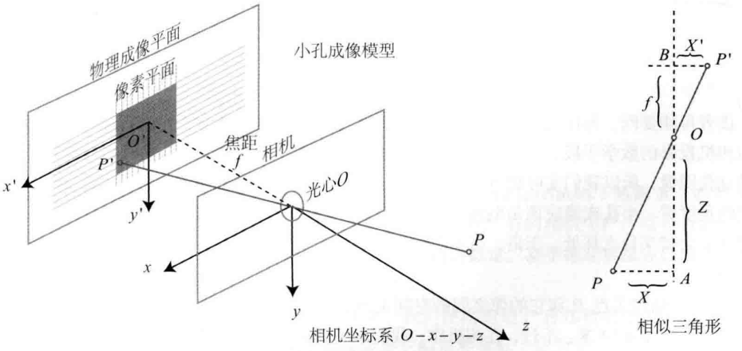
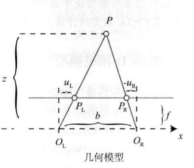

# 相机成像模型

## 1. 针孔相机模型   
> 简述:    
>  * **相机坐标系**：$O-X-Y-Z$: 原点$O$在光心,$x$轴向右(观测角度相机正对物体方向)，$y$轴向下，$z$轴指向待拍摄物体。单位:$m$
>  * **物理成像平面坐标系**:$O^`-X^`-Y^`$ 物理    ,单位:$m$
>  * **像素平面坐标系**$O^{``}-U-V$：原点$O^{``}$在成像图片的的左上角，$U$轴向右，$V$轴向下.单位:$像素$
>  * **归一化平面坐标系**: 相机坐标系下$Z=1$的平面 

由图可知，点$P_{c}$(相机坐标系下的点P)在物理成像平面上的成像为$P_{C}^`$,满足几何关系:
$$
\tag{1.1}
\frac{Z}{f}=\frac{X}{X^`}=\frac{Y}{Y^`}
$$

> 式中(单位均为$m$):    
> $Z$: &emsp;是$P$距离相机距离    
> $f$: &emsp;是相机焦距

即有:
$$
\tag{1.2}
\left\{
    \begin{aligned}
        X^`&=f\frac{X}{Z}\\
        Y^`&=f\frac{Y}{Z}
    \end{aligned}
\right.
$$

## 2. 内参矩阵

考虑相机成像平面上一点$P_C(X^`,Y^`)$对应像素平面上的坐标为$P^{``}(x,y)$, 成像平面原点$O^`$在像素平面上的坐标为$(c_x,c_y)$, 其中成像平面相对像素平面在$u,v$轴上的缩放分别为$\alpha, \beta$(表示像素平面的像素与成像平面的度量$m$的对应关系),单位为$\frac{像素}{m}$,即有：
$$
\tag{2.1}
\left\{
    \begin{aligned}
        x &= \alpha X^` + c_x=\alpha f \frac{X}{Z}\\
        y &= \beta Y^` + c_y=\beta f \frac{Y}{Z}
    \end{aligned}
\right.
$$

> 记: $f_x=\alpha f; f_y=\beta f$ 上式可表换为:
$$
\tag{2.2}
\left\{
    \begin{aligned}
        x &=f_x\frac{X}{Z}\\
        y &=f_y\frac{Y}{Z}
    \end{aligned}
\right.
$$

将上式改写为齐次坐标的矩阵形式:
$$
\tag{2.3}
\begin{bmatrix}
    x\\
    y\\
    1
\end{bmatrix}

=
\frac{1}{Z}
\begin{bmatrix}
    f_x   &   0   &   c_x \\
    0     &   f_y &   c_y \\
    0     &   0   &   1 
\end{bmatrix}

\begin{bmatrix}
    X\\
    Y\\
    Z
\end{bmatrix}
$$

即有:
$$
\tag{2.4}
P^{``} = \frac{1}{Z}KP_C$$
其中K称为内参矩阵：
$$
\tag{2.5}
K = 
\begin{bmatrix}
    f_x   &   0   &   c_x \\
    0     &   f_y &   c_y \\
    0     &   0   &   1 
\end{bmatrix}
$$
* 提示: $f_x,f_y,c_x,c_y$单位均为像素
 
 

## 3. 外参矩阵
考虑世界坐标系下点$P_W$在相机坐标系下为:
$$
\tag{3.1}
P_C=T_{CW}P_W=\boldsymbol{R}P_W+t=
\begin{bmatrix}
    R&t\\
    0^T&1
\end{bmatrix}
P_W
$$

则$T_{CW}=
\begin{bmatrix}
    R&t\\
    0^T&1
\end{bmatrix}
$为相机的外参矩阵，外参矩阵描述了世界坐标系下的点到相机坐标系的变换。

将式$(2.4)$带入式$(3.1)$有:
$$
\tag{3.2}
P^{``}=\frac{1}{Z}KT_{CW}P_W
=
\frac{1}{Z}
\begin{bmatrix}
    f_x   &   0   &   c_x \\
    0     &   f_y &   c_y \\
    0     &   0   &   1 
\end{bmatrix}
\begin{bmatrix}
    R&t\\
    0^T&1
\end{bmatrix}
P_W
$$

上式描述了世界坐标系下的点$P_W(X_W,Y_W,Z_W)$到像素坐标系下点$P^{``}(x,y)$的过程
 
 

## 4.归一化平面
考虑如下变换:
$$
\tag{4.1}
P_C=RP_W+t=[X,Y,Z]^T\rightarrow[\frac{X}{Z},\frac{Y}{Z},1]^T$$
归一化坐标表示在$Z=1$时的坐标。 将三维空间点$P_C(X,Y,Z)$投影到归一化平面$P_G(X^{-},Y^{-})$   
归一化坐标左乘内参矩阵即为对应像素坐标:
$$
\tag{4.2}
P^{``}=KP_{C_{z=1}}$$

 
 

## 5.畸变模型     

> 畸变纠正模型:    
> ① 将三维空间点投影到归一化图像平面，投影后的坐标为$[x,y]^T$   
> ② 对归一化平面上的点计算径向畸变和切向畸变
> $$
>    \tag{5.1}
>    \left\{
>        \begin{aligned}
>            x_{distorted}&=x(1+k_1r^2+k_2r^4+k_3r^6)+2p_1xy+p_2(r^2+2x^2)\\
>            y_{distorted}&=y(1+k_1r^2+k_2r^4+k_3r^6)+p_1(r_2+2y^2)+2p_2xy
>        \end{aligned}
>    \right.
>  $$
> ③ 将畸变校正后的点左乘内参矩阵投影到像素平面:
> $$
>   \tag{5.2}
>   \begin{bmatrix}
>       x_p\\
>       y_p 
>   \end{bmatrix}
>  =
>  \begin{bmatrix}
>       f_x&  0  &  c_x\\
>       0  &  f_y&  c_y\\
>       0  &   0  &  1  
>  \end{bmatrix}
>  \begin{bmatrix}
>       x_{distorted}\\
>       y_{distorted}
>  \end{bmatrix}
> $$

## 6. 单目相机成像过程简述   
① 世界坐标系下有一个固定的点$P$, $P$在世界坐标系下描述为$P_W$。    
② 由于相机在运动，相机运动由变换矩阵$\boldsymbol{T}=\begin{bmatrix}
    R&t\\0^T&1
\end{bmatrix}$描述，并有$\boldsymbol{T}\in SE(3)$，则有相机坐标系的估计点:
$$
    \tag{6.1}
    \widetilde{P}_C=TP_W=RP_W+t
$$
③ 这时的$\widetilde{P}_c=(X,Y,Z)$,投影到归一化平面$Z=1$上，得到$P$的归一化坐标$P_C=[X/Z,Y/Z,1]^T$    
④ 对归一化坐标$[X/Z,Y/Z]$畸变矫正得:$\rightarrow[x_{distorted},y_{distorted}]^T$    
⑤ 畸变校正后的坐标左乘内参矩阵，得像素坐标:
$$[x,y]^T=K[x_{distorted},y_{distorted}]^T$$

## 7. 双目相机成像、测距及重建机理
* 双目相机几何原理    

根据三角形相似关系有:
$$\frac{z-f}{z}=\frac{b-u_L+u_R}{b}$$

整理得:
$$z=\frac{fb}{d}$$

> 式中:    
> $d=u_L-u_R$(左右图的横坐标之差)    
> $b$：基线长度