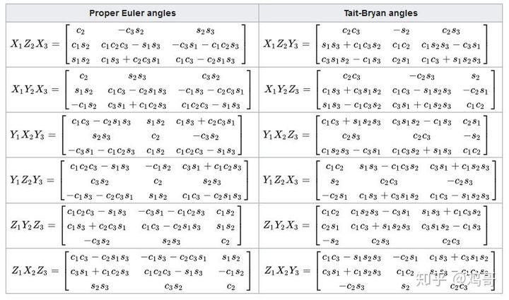

# 四元数、欧拉角、旋转矩阵、旋转向量(Axis-Angle)相互转换

## 1. 欧拉角($Euler Angle$) $\rightarrow$ 旋转矩阵($Rotation Matrix$)

* 定义元素旋转矩阵:    
$$
\tag{1.1}
\boldsymbol{R}_x(\alpha)
=
\begin{bmatrix}
    1      &      0          &      0           \\
    0      &      \cos\alpha  &      -\sin \alpha  \\
    0      &      \sin \alpha  &      \cos\alpha   \\
\end{bmatrix}
$$

 

$$
\tag{1.2}
\boldsymbol{R}_y(\beta)
=
\begin{bmatrix}
    \cos\beta & 0 & \sin\beta\\
    0        & 1 &  0       \\
    -\sin\beta& 0 & \cos\beta\\
\end{bmatrix}
$$

 

$$
\tag{1.3}
\boldsymbol{R}_z(\gamma)
=
\begin{bmatrix}
    \cos\gamma    &  -\sin\gamma    &    0 \\
    \sin\gamma    &  \cos\gamma     &    0 \\
    0            &  0             &    1  
\end{bmatrix}
$$

* 按$ZXY$旋转(左乘一次做一次旋转) ($ZXY \rightarrow 矩阵乘顺序:Y_1 X_2Z_3$),

$$
\tag{1.4}
\begin{aligned}
    \boldsymbol{R}
     &= \boldsymbol{R}_y(\beta) \cdot \boldsymbol{R}_x(\alpha) \cdot \boldsymbol{R}_z(\gamma)\\
&=

\begin{bmatrix}
    \cos\beta & 0 & \sin \beta\\
    0        & 1 &  0       \\
    -\sin\beta& 0 & \cos\beta\\
\end{bmatrix}

\cdot

\begin{bmatrix}
    1      &      0          &      0           \\
    0      &      \cos\alpha  &      -\sin\alpha  \\
    0      &      \sin\alpha  &      \cos\alpha   \\
\end{bmatrix}

\cdot

\begin{bmatrix}
    \cos\gamma    &  -\sin\gamma    &    0 \\
    \sin\gamma    &  \cos\gamma     &    0 \\
    0            &  0             &    1  
\end{bmatrix}\\

&=

\begin{bmatrix}
    \cos\beta \cos\gamma+\sin\beta \sin\alpha \sin\gamma & \cos\gamma \sin\beta \sin\alpha-\cos\beta \sin\gamma & \cos\alpha \sin\beta \\
    \cos \alpha \sin\gamma& \cos\alpha\cos\gamma&-\sin\alpha\\
    \cos\beta\sin\alpha\sin\gamma-\cos\gamma\sin\beta&\cos\beta\cos\gamma\sin\alpha+\sin\beta\sin\gamma&\cos\beta\cos\alpha
\end{bmatrix}

\\

&=

\begin{bmatrix}
    c_1c_3+s_1s_2s_3 & c_3s_1s_2-c_1s_3&c_2s_1\\
    c_2s_3&c_2c_3&-s_2\\
    c_1s_2s_3-c_3s_1&c_1c_3s_2+s_1s_3&c_1c_2
\end{bmatrix}

\end{aligned}
$$

> 其中:
> * $c_1=\cos\beta=\cos(Yaw),c_2=\cos\alpha=\cos(Piath),c_3=\cos\gamma=\cos(Roll)$
> * $s_1=\sin\beta=\sin(Yaw),c_2=\sin\alpha=\sin(Piath),c_3=\sin\gamma=\sin(Roll)$

* 同理可得其它顺序旋转矩阵:    

## 2. 旋转矩阵$\rightarrow$欧拉角
  * Yaw: $\beta = \arctan^2(m_{13},m_{33})$
  * Pitch: $\alpha = \arcsin(-m_{23})$
  * Roll: $\gamma=\arctan^2(m_{21},m_{22})$

## 3. 四元数$\rightarrow$旋转矩阵
* $Q=w+xi+yj+zk$
$$
R(q)=
\begin{bmatrix}
    1-zy^2-2z^2&2xy-zzw&2xy+2yw\\
    2xy+2zw&1-2x^2-2z^2&2yz-2xw\\
    2xz-2yw&2yz+2xw&1-2x^2-2y^2
\end{bmatrix}
$$

## 4. 旋转矩阵$\rightarrow$四元数

$$
\left\{
    \begin{aligned}
        w&=\frac{\sqrt{tr(R)+1}}{2}\\

        x&=\frac{m_{32}-m_{23}}{4w}\\
        y&=\frac{m_{13}-m_31}{4w}\\
        z&=\frac{m_{21}-m_{12}}{4w}
    \end{aligned}
\right.
$$